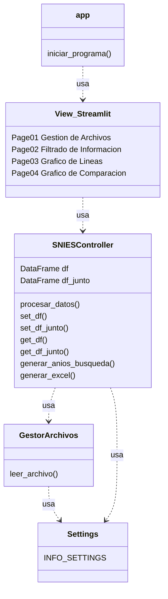
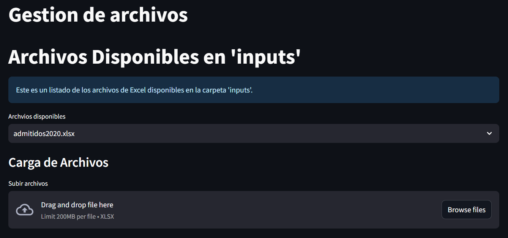
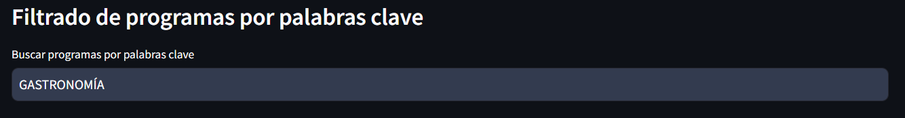
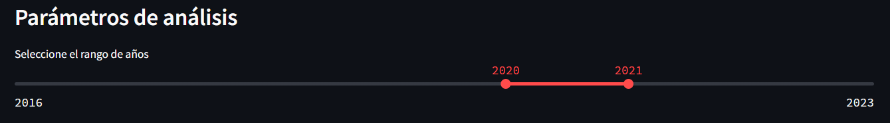
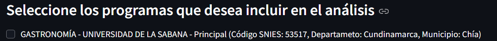
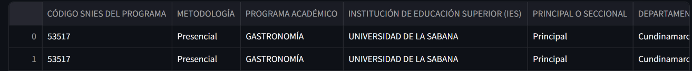
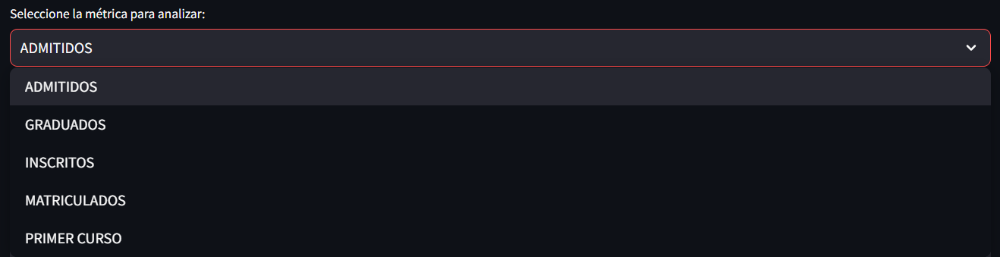
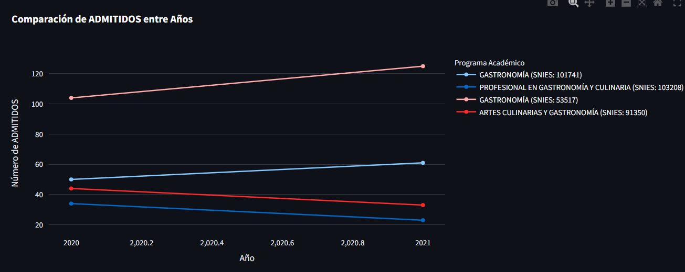
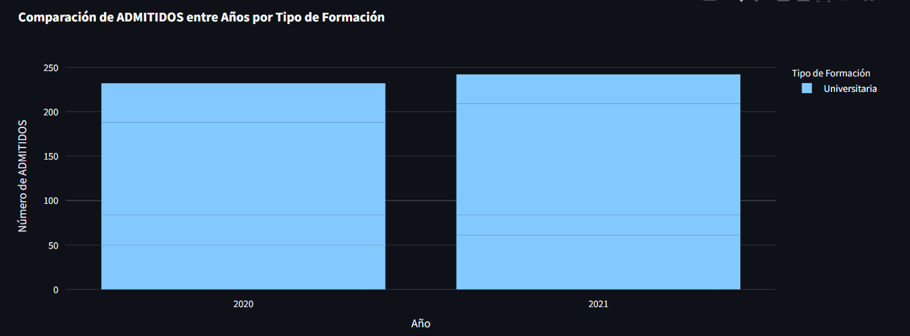

# snies_proyecto_3
Proyecto_3

# **SNIES EXTRACTOR por Syntax Error™**

El SNIES EXTRACTOR es un software que permite el análisis de los datos de estudiantes universitarios publicados por el Sistema Nacional de Instituciones de Educación Superior (SNIES) de Colombia a partir de los archivos de excel publicados en su página oficial.

**Link al SNIES:**

* <https://snies.mineducacion.gov.co/portal/ESTADISTICAS/Bases-consolidadas/> 

El programa abrirá una página web en su navegador dondé podrá interactuar con el SNIES EXRACTOR. Para ejecutarlo primero, debe descargar este repositorio, crear un entorno virtual llamado *venv* o *.venv* y abrir el archivo *Ejecutar\_SNIES\_EXTRACTOR.cmd,* el cual le abrirá una ventana de la terminal de su dispositivo y una página web en su navegador predeterminado.

Aquí tienen un link a una DEMO sin necesidad de instalar el repositorio:

- https://syntaxerrorsnies.streamlit.app/

**Requerimientos del dispositivo:**

- Sistema Operativo Windows

**Diagrama UML del Proyecto**

# Manual Técnico

## Detalles del Funcionamiento del Proyecto

Detallaremos el funcionamiento del proyecto en esta sección.  
El proyecto está basado en Python y utiliza las bibliotecas **Pandas** y **Streamlit** para funcionar, y tiene múltiples funcionalidades, las cuales son las siguientes:

- **Lectura de archivos `.xlsx` (Excel)**
- **Búsqueda de programas académicos** por palabras clave.
- Selección de programas que se desean analizar.
- Análisis de estudiantes en distintas etapas:
  - Inscritos, admitidos, matriculados por primera vez,
  - Total de matriculados,
  - Total de graduados por programa.
- **Visualización de la información** de los programas seleccionados.
- Generación de **gráficos de líneas y barras** por tendencia histórica con los programas seleccionados y el dato que se desea analizar.
- Generación de un **gráfico comparativo** entre los programas seleccionados.
- **Subida de archivos** a la página generada con Streamlit.

---

### Explicación de las Funcionalidades

Una vez vistas todas las funcionalidades, pasemos a explicar cómo se utiliza cada una.

La lectura de archivos .xlsx es la que nos permite obtener todos los datos que vamos a manejar, esta lee los archivos que ya están dentro del repositorio y los transforma en un dataframe para facilitar su manejo a la hora de obtener los datos deseados de estos archivos y sus programas. Si se requiere, el programa automáticamente incluye en la lectura de archivos a los archivos que puede subir el usuario, estos se crean de manera temporal en el programa y una vez subidos se utilizan como los que ya son nativos al programa.

El buscar programa académico por palabra clave es simple. En la página web sale un recuadro que dice: “*buscar por palabra clave”*, en ese recuadro es donde el usuario introduce la palabra que desea utilizar y debajo de este le saldrán todos los programas que contengan esta palabra.

En este momento del programa es cuando se leen todos los archivos de los programas académicos y donde se selecciona el rango de años deseado para el análisis de los datos.

Después de escribir el programa se selecciona el rango de años en el cual se desea analizar con una barra de selección.

El programa una vez se le introduzca una palabra clave va a desplegar todos los programas que contengan esta palabra y podemos ver el nombre completo del programa, de que universidad es, si es principal o seccional, su código snies, su departamento y su municipio.

Elegir programa es bastante intuitivo, una vez se tenga el programa deseado a elegir, simplemente es hacer click sobre una checkbox que sale al lado del nombre del programa y una vez con esto seleccionado se tomará en cuenta este programa para su análisis (poner imagen antes y después de seleccionarlo).

Una vez tenemos seleccionados los programas, se genera debajo de estos una tabla la cual contiene todos los consolidados de dicho programa para el rango de años elegido y en el cual se nos muestran todos los datos de los consolidados.

Una vez seleccionado el programa pasamos a las gráficas, estas te van a permitir seleccionar el dato que deseas analizar y en la gráfica te muestra los programas que seleccionaste para el análisis.

Es una funcionalidad similar para la otra gráfica, puedes seleccionar lo que quieras analizar sin embargo en esta es por año y los programas están en cuadros en un mismo año y separados por categoría de nivel de formación.

